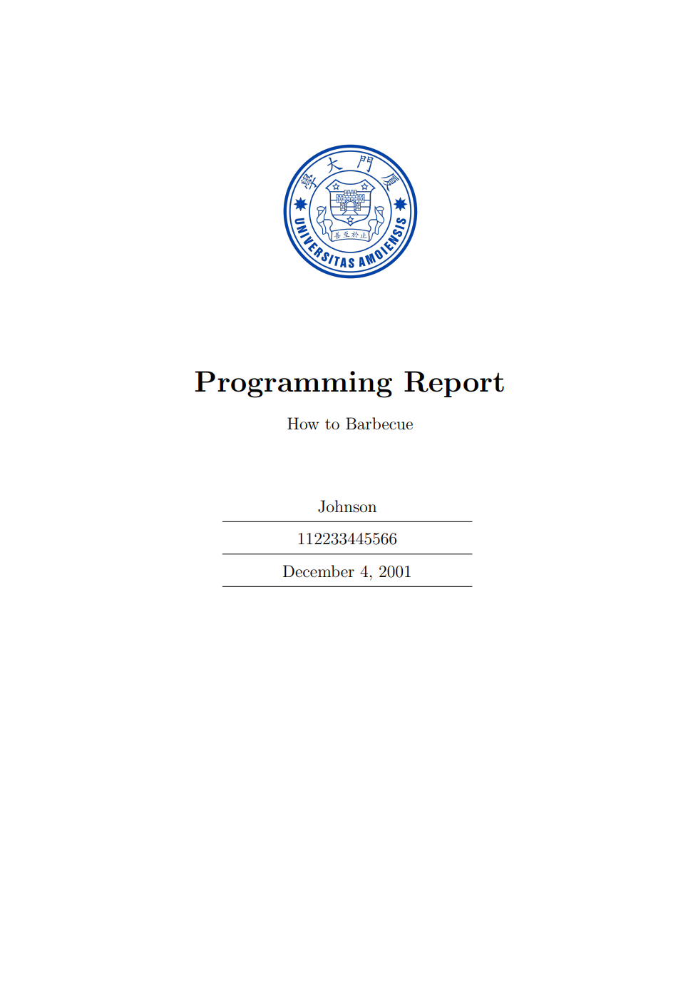

# LaTeX Report Template for XMU

A compact and easy-to-use template for reports and homework articles in LaTeX.

## Why

As the reports and homework are going to contain more and more formulas and codes, Word makes typesetting difficult and makes it hard to form a consisting style for all my documents. Therefore I use LaTeX for as many writings as I can, and for the sake of starting quickly, I make these templates.

## Quick Tutorial

To control most of the generated content like the cover and page header, these code in the beginning of the file should be changed.

```latex
%%%%%%%%%%%%%
\newcommand{\StudentNumber}{112233445566}  % Fill your student number here
\newcommand{\StudentName}{Johnson}  % Replace your name here
\newcommand{\PaperTitle}{How to Barbecue}  % Change your paper title here
\newcommand{\PaperType}{Programming Report} % Replace the type of your report here
\newcommand{\Date}{December 4, 2001}
%%%%%%%%%%%%%
```

## Showcase



## Built with

I make these templates under

- MikTeX distribution
- pdflatex compiler

The following packages will be required if the template is used:

- blindtext 
- geometry 
- ctex 
- listings 
- xcolor 
- geometry 
- amsmath 
- float 
- hyperref 
- graphics 
- graphicx 
- subfigure 
- epsfig 
- float 
- booktabs 
- threeparttable 
- longtable 
- algorithmic 
- algorithm 
- listings 
- cite 
- color 
- xcolor 
- amssymb 
- amsthm 
- amsfonts 
- enumerate 
- enumitem 
- listings 
- indentfirst 
- setspace 
- siunitx 
- fancyhdr 
- lastpage 


## License
Copyright (c) 2022 SmartPolarBear

Permission is hereby granted, free of charge, to any person obtaining a copy of this software and associated documentation files (the "Software"), to deal in the Software without restriction, including without limitation the rights to use, copy, modify, merge, publish, distribute, sublicense, and/or sell copies of the Software, and to permit persons to whom the Software is furnished to do so, subject to the following conditions:

The above copyright notice and this permission notice shall be included in all copies or substantial portions of the Software.

THE SOFTWARE IS PROVIDED "AS IS", WITHOUT WARRANTY OF ANY KIND, EXPRESS OR IMPLIED, INCLUDING BUT NOT LIMITED TO THE WARRANTIES OF MERCHANTABILITY, FITNESS FOR A PARTICULAR PURPOSE AND NONINFRINGEMENT. IN NO EVENT SHALL THE AUTHORS OR COPYRIGHT HOLDERS BE LIABLE FOR ANY CLAIM, DAMAGES OR OTHER LIABILITY, WHETHER IN AN ACTION OF CONTRACT, TORT OR OTHERWISE, ARISING FROM, OUT OF OR IN CONNECTION WITH THE SOFTWARE OR THE USE OR OTHER DEALINGS IN THE SOFTWARE.

